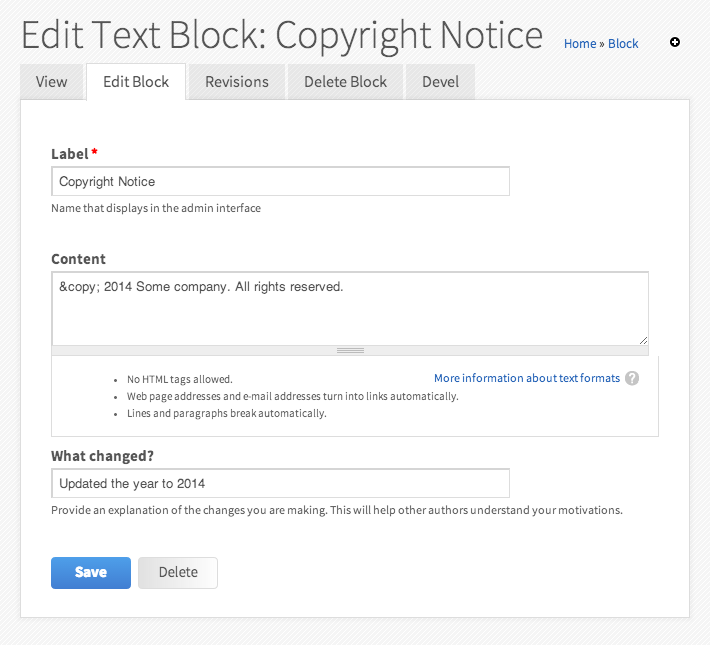

Bean Text Block
===============

Bean Text Block is a small Drupal module that allows users to create simple
text blocks for use on their site.  This module, combined with the power of
beans (block entities) can essentially replace the core Block module. Note:
a small [patch](https://drupal.org/node/2114279) to the bean module is
required to replace the core block module.

The module is a simple demonstration of a custom _bean_ with a single
_Long text_ field exported to code via _features_.

The module simplifies the administrative UI for creating beans in the following
ways:

* Hide the _view mode_ drop-down; simple text blocks need only the 'Default' view mode.
* Hide the _title_ field.
* Streamline the _revision_ fields down to a oneline text field: "What Changed?".

Dependencies
------------

* [Bean](https://drupal.org/project/bean)
* [CTools](https://drupal.org/project/ctools)
* [Features](https://drupal.org/project/features)
